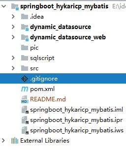

# springboot_hykaricp_mybatis

### 项目须知：
###### 配置全局.gitignore
1.在C:\Users\Administrator下创建.gitignore_global
```git
git config --global core.excludesfile ~/.gitignore_global
```
2.在C:\Users\Administrator下检查.gitconfig文件内容, 确保已经设置excludesfile
```text
[user]
	name = AK47Sonic
	email = ******@qq.com
[core]
	excludesfile = C:/Users/Administrator/.gitignore_global
```
3.使用Git Bash 创建.gitignore_global
```git
$ cd ~
$ vi .gitignore_global
```
4.在.gitignore_global文件中添加如下内容
```text

# Compiled class file
*.class

# Log file
*.log

# BlueJ files
*.ctxt

# Mobile Tools for Java (J2ME)
.mtj.tmp/

# Package Files #
*.jar
*.war
*.nar
*.ear
*.zip
*.tar.gz
*.rar

# virtual machine crash logs, see http://www.java.com/en/download/help/error_hotspot.xml
hs_err_pid*

# IntelliJ project files
.idea
*.iml
*.ipr
*.iws
out
gen

# Eclipse project files
.settings
.project
.classpath

# Maven
target

```
5.验证是否在Eclipse或者IDEA的提交列表中已经排除工程类文件
6.如果有自己的一些特殊文件不需要提交的，请在本项目中的.gitignore文件中设置




